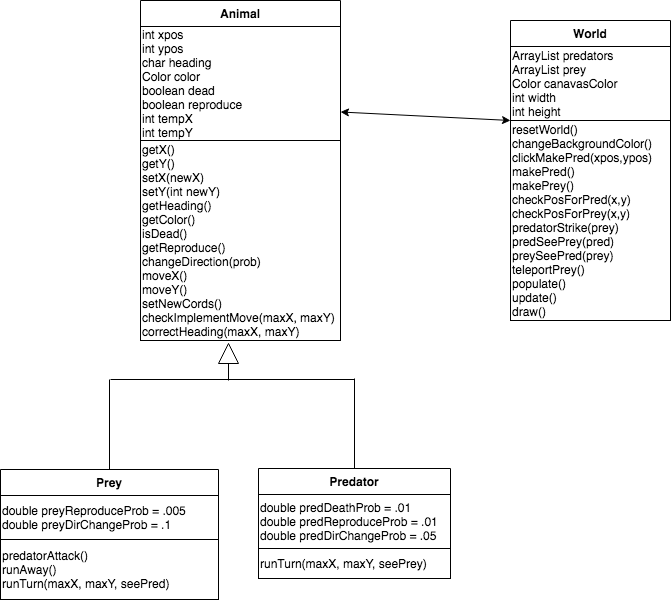

# Predator Prey Simulation

**Project Info**

   This project is a basic GUI simulation with predators and prey. The predators (red squares) move around in the screen and try to eat the prey (randomly colored circles). See the info below to understand how the classes interact.

**Created by: Joshua Groover** 
 - jgroover@gwu.edu
 - github id: joshua-groover

**To run this project:** 
- Compile and run predator_prey_sim/PPSim.java 

**User Commands**
- Space Bar: Change the background color
- Enter Key: Reset the simulation
- Mouse Click on Screen: Create a new predator at click location
- Shift Key: Teleport all of the prey to a new location

---
**UML Diagram**

**__How the code works__**

- PPSIM.java creates an instance of World with: a random background color, 5 predators (red boxes), and 10 prey (circles with random colors)
- The world is updated - each predator and prey run their "runTurn" methods to update characteristcs about themselves

   __Predators:__ A subclass of Animal. Have a 1% chance of dying and 1% chance of reproducing. If the predator is next to a prey (above, below, right, or left), the predator eats the prey unless the prey is the same color as the background. If a predator sees a prey less than 16 spaces ahead of it, the predator moves towards the prey. Otherwise, the predator moves forward and has a 5% chance of turning in a random direction (direction change is before the predator moves forward).

   __Prey:__ A subclass of Animal. Have a .5% chance of reproducing. If a prey sees a predator less than 11 spaces ahead of it, the prey turns around and moves two spaces away from the predator. Otherwise, the prey moves forward and has a 10% chance of turning in a random direction (direction change is before the prey moves forward).

- The user can also give inputs to the simulation.. They are as follows:

   __Space Bar__ Change the background color, __Enter Key__ Reset the simulation, __Mouse Click on Screen__ Create a new predator at click location, __Shift Key__ Teleport all of the prey to a new location

- Eventually, either the predator or the prey will win out! **__But you won't know which one until you run the code now will you?__**

**_Extra Feature_**

_Teleporting Prey_

- In the PPSim file, there is a KeyListener instance and a keyPressed() function. When any key is pressed, the KeyListener triggers keyPressed() to determine which key has been pressed. If the shift key has been pressed, keyPressed() calls teleportPrey() in the World instance. teleportPrey() iterates through all of the prey and changes their x and y coordinates to a random location.